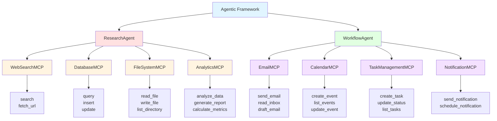

```mermaid
graph TD
    Framework[Agentic Framework]
    
    Framework --> Agent1[ResearchAgent]
    Framework --> Agent2[WorkflowAgent]
    
    Agent1 --> MCP1[WebSearchMCP]
    Agent1 --> MCP2[DatabaseMCP]
    Agent1 --> MCP3[FileSystemMCP]
    Agent1 --> MCP4[AnalyticsMCP]
    
    Agent2 --> MCP5[EmailMCP]
    Agent2 --> MCP6[CalendarMCP]
    Agent2 --> MCP7[TaskManagementMCP]
    Agent2 --> MCP8[NotificationMCP]
    
    MCP1 --> Cap1[search<br/>fetch_url]
    MCP2 --> Cap2[query<br/>insert<br/>update]
    MCP3 --> Cap3[read_file<br/>write_file<br/>list_directory]
    MCP4 --> Cap4[analyze_data<br/>generate_report<br/>calculate_metrics]
    
    MCP5 --> Cap5[send_email<br/>read_inbox<br/>draft_email]
    MCP6 --> Cap6[create_event<br/>list_events<br/>update_event]
    MCP7 --> Cap7[create_task<br/>update_status<br/>list_tasks]
    MCP8 --> Cap8[send_notification<br/>schedule_notification]
    
    style Framework fill:#e1f5ff
    style Agent1 fill:#ffe1e1
    style Agent2 fill:#e1ffe1
    style MCP1 fill:#fff4e1
    style MCP2 fill:#fff4e1
    style MCP3 fill:#fff4e1
    style MCP4 fill:#fff4e1
    style MCP5 fill:#f4e1ff
    style MCP6 fill:#f4e1ff
    style MCP7 fill:#f4e1ff
    style MCP8 fill:#f4e1ff
```
