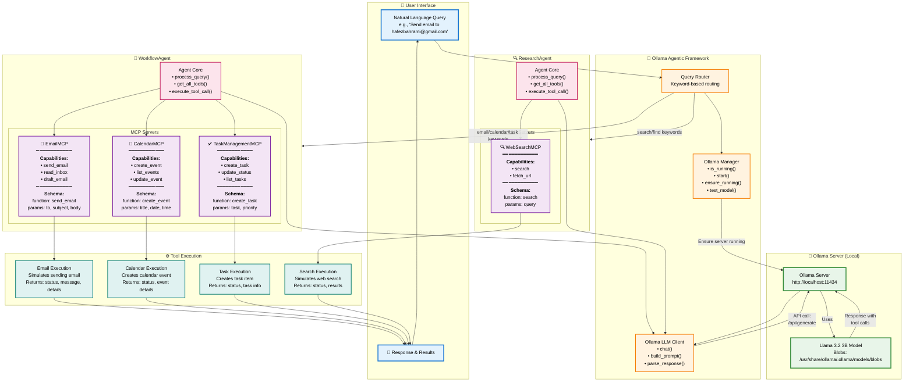

```mermaid
graph TB
    subgraph User["👤 User Interface"]
        Query["Natural Language Query<br/>e.g., 'Send email to hafezbahrami@gmail.com'"]
        Response["📝 Response & Results"]
    end
    
    subgraph Framework["🚀 Ollama Agentic Framework"]
        Router["Query Router<br/>Keyword-based routing"]
        OllamaManager["Ollama Manager<br/>• is_running()<br/>• start()<br/>• ensure_running()<br/>• test_model()"]
        LLMClient["Ollama LLM Client<br/>• chat()<br/>• build_prompt()<br/>• parse_response()"]
    end
    
    subgraph Ollama["🦙 Ollama Server (Local)"]
        Server["Ollama Server<br/>http://localhost:11434"]
        Model["Llama 3.2 3B Model<br/>Blobs: /usr/share/ollama/.ollama/models/blobs"]
    end
    
    subgraph Agent1["🤖 WorkflowAgent"]
        WA_Core["Agent Core<br/>• process_query()<br/>• get_all_tools()<br/>• execute_tool_call()"]
        
        subgraph WA_MCP["MCP Servers"]
            EmailMCP["📧 EmailMCP<br/>━━━━━━━━━━━━<br/><b>Capabilities:</b><br/>• send_email<br/>• read_inbox<br/>• draft_email<br/>━━━━━━━━━━━━<br/><b>Schema:</b><br/>function: send_email<br/>params: to, subject, body"]
            CalendarMCP["📅 CalendarMCP<br/>━━━━━━━━━━━━<br/><b>Capabilities:</b><br/>• create_event<br/>• list_events<br/>• update_event<br/>━━━━━━━━━━━━<br/><b>Schema:</b><br/>function: create_event<br/>params: title, date, time"]
            TaskMCP["✅ TaskManagementMCP<br/>━━━━━━━━━━━━<br/><b>Capabilities:</b><br/>• create_task<br/>• update_status<br/>• list_tasks<br/>━━━━━━━━━━━━<br/><b>Schema:</b><br/>function: create_task<br/>params: task, priority"]
        end
    end
    
    subgraph Agent2["🔍 ResearchAgent"]
        RA_Core["Agent Core<br/>• process_query()<br/>• get_all_tools()<br/>• execute_tool_call()"]
        
        subgraph RA_MCP["MCP Servers"]
            SearchMCP["🔍 WebSearchMCP<br/>━━━━━━━━━━━━<br/><b>Capabilities:</b><br/>• search<br/>• fetch_url<br/>━━━━━━━━━━━━<br/><b>Schema:</b><br/>function: search<br/>params: query"]
        end
    end
    
    subgraph Execution["⚙️ Tool Execution"]
        EmailExec["Email Execution<br/>Simulates sending email<br/>Returns: status, message, details"]
        CalendarExec["Calendar Execution<br/>Creates calendar event<br/>Returns: status, event details"]
        TaskExec["Task Execution<br/>Creates task item<br/>Returns: status, task info"]
        SearchExec["Search Execution<br/>Simulates web search<br/>Returns: status, results"]
    end
    
    %% User flow
    Query --> Router
    Response --> Query
    
    %% Router to Framework
    Router -->|"email/calendar/task keywords"| Agent1
    Router -->|"search/find keywords"| Agent2
    
    %% Framework to Ollama
    Router --> OllamaManager
    OllamaManager -->|"Ensure server running"| Server
    
    %% Agents to LLM
    WA_Core --> LLMClient
    RA_Core --> LLMClient
    
    %% LLM to Ollama
    LLMClient -->|"API call:<br/>/api/generate"| Server
    Server -->|"Uses"| Model
    Model -->|"Response with<br/>tool calls"| Server
    Server --> LLMClient
    
    %% Agents to MCP Servers
    WA_Core --> EmailMCP
    WA_Core --> CalendarMCP
    WA_Core --> TaskMCP
    RA_Core --> SearchMCP
    
    %% MCP to Execution
    EmailMCP --> EmailExec
    CalendarMCP --> CalendarExec
    TaskMCP --> TaskExec
    SearchMCP --> SearchExec
    
    %% Execution to Response
    EmailExec --> Response
    CalendarExec --> Response
    TaskExec --> Response
    SearchExec --> Response
    
    %% Styling
    classDef userStyle fill:#e3f2fd,stroke:#1976d2,stroke-width:3px,color:#000
    classDef frameworkStyle fill:#fff3e0,stroke:#f57c00,stroke-width:2px,color:#000
    classDef ollamaStyle fill:#e8f5e9,stroke:#388e3c,stroke-width:3px,color:#000
    classDef agentStyle fill:#fce4ec,stroke:#c2185b,stroke-width:2px,color:#000
    classDef mcpStyle fill:#f3e5f5,stroke:#7b1fa2,stroke-width:2px,color:#000
    classDef execStyle fill:#e0f2f1,stroke:#00796b,stroke-width:2px,color:#000
    
    class Query,Response userStyle
    class Router,OllamaManager,LLMClient frameworkStyle
    class Server,Model ollamaStyle
    class WA_Core,RA_Core agentStyle
    class EmailMCP,CalendarMCP,TaskMCP,SearchMCP mcpStyle
    class EmailExec,CalendarExec,TaskExec,SearchExec execStyle
```
