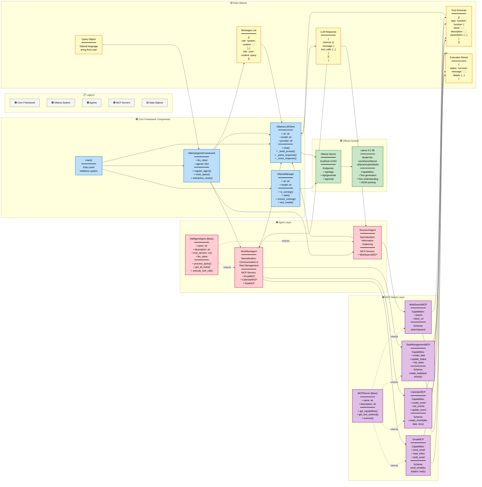

```mermaid
graph LR
    subgraph Legend["📋 Legend"]
        L1["🟦 Core Framework"]
        L2["🟩 Ollama System"]
        L3["🟥 Agents"]
        L4["🟪 MCP Servers"]
        L5["🟨 Data Objects"]
    end
    
    subgraph Core["🟦 Core Framework Components"]
        Main["main()<br/>━━━━━━━━━━<br/>Entry point<br/>Initializes system"]
        
        OManager["OllamaManager<br/>━━━━━━━━━━<br/>• url: str<br/>• model: str<br/>━━━━━━━━━━<br/>+ is_running()<br/>+ start()<br/>+ ensure_running()<br/>+ test_model()"]
        
        Framework["OllamaAgenticFramework<br/>━━━━━━━━━━<br/>• llm_client<br/>• agents: Dict<br/>━━━━━━━━━━<br/>+ register_agent()<br/>+ route_query()<br/>+ interactive_mode()"]
        
        LLMClient["OllamaLLMClient<br/>━━━━━━━━━━<br/>• url: str<br/>• model: str<br/>• provider: str<br/>━━━━━━━━━━<br/>+ chat()<br/>+ _build_prompt()<br/>+ _parse_response()<br/>+ _mock_response()"]
    end
    
    subgraph OllamaSystem["🟩 Ollama System"]
        Server["Ollama Server<br/>━━━━━━━━━━<br/>localhost:11434<br/>━━━━━━━━━━<br/>Endpoints:<br/>• /api/tags<br/>• /api/generate<br/>• /api/chat"]
        
        Model["Llama 3.2 3B<br/>━━━━━━━━━━<br/>Model file:<br/>/usr/share/ollama/<br/>.ollama/models/blobs<br/>━━━━━━━━━━<br/>Capabilities:<br/>• Text generation<br/>• Tool understanding<br/>• JSON parsing"]
    end
    
    subgraph Agents["🟥 Agent Layer"]
        BaseAgent["IntelligentAgent (Base)<br/>━━━━━━━━━━<br/>• name: str<br/>• description: str<br/>• mcp_servers: List<br/>• llm_client<br/>━━━━━━━━━━<br/>+ process_query()<br/>+ get_all_tools()<br/>+ execute_tool_call()"]
        
        WAgent["WorkflowAgent<br/>━━━━━━━━━━<br/>Specialization:<br/>Communication &<br/>Task Management<br/>━━━━━━━━━━<br/>MCP Servers:<br/>• EmailMCP<br/>• CalendarMCP<br/>• TaskMCP"]
        
        RAgent["ResearchAgent<br/>━━━━━━━━━━<br/>Specialization:<br/>Information<br/>Gathering<br/>━━━━━━━━━━<br/>MCP Servers:<br/>• WebSearchMCP"]
    end
    
    subgraph MCPServers["🟪 MCP Server Layer"]
        BaseMCP["MCPServer (Base)<br/>━━━━━━━━━━<br/>• name: str<br/>• description: str<br/>━━━━━━━━━━<br/>+ get_capabilities()<br/>+ get_tool_schema()<br/>+ execute()"]
        
        EmailMCP["EmailMCP<br/>━━━━━━━━━━<br/>Capabilities:<br/>• send_email<br/>• read_inbox<br/>• draft_email<br/>━━━━━━━━━━<br/>Schema:<br/>send_email(to,<br/>subject, body)"]
        
        CalendarMCP["CalendarMCP<br/>━━━━━━━━━━<br/>Capabilities:<br/>• create_event<br/>• list_events<br/>• update_event<br/>━━━━━━━━━━<br/>Schema:<br/>create_event(title,<br/>date, time)"]
        
        TaskMCP["TaskManagementMCP<br/>━━━━━━━━━━<br/>Capabilities:<br/>• create_task<br/>• update_status<br/>• list_tasks<br/>━━━━━━━━━━<br/>Schema:<br/>create_task(task,<br/>priority)"]
        
        SearchMCP["WebSearchMCP<br/>━━━━━━━━━━<br/>Capabilities:<br/>• search<br/>• fetch_url<br/>━━━━━━━━━━<br/>Schema:<br/>search(query)"]
    end
    
    subgraph DataFlow["🟨 Data Objects"]
        Query["Query Object<br/>━━━━━━━━━━<br/>Natural language<br/>string from user"]
        
        Messages["Messages List<br/>━━━━━━━━━━<br/>[{<br/>  role: 'system',<br/>  content: '...'<br/>}, {<br/>  role: 'user',<br/>  content: query<br/>}]"]
        
        Tools["Tool Schemas<br/>━━━━━━━━━━<br/>[{<br/>  type: 'function',<br/>  function: {<br/>    name: '...',<br/>    description: '...',<br/>    parameters: {...}<br/>  }<br/>}]"]
        
        Response["LLM Response<br/>━━━━━━━━━━<br/>{<br/>  choices: [{<br/>    message: {<br/>      tool_calls: [...]<br/>    }<br/>  }]<br/>}"]
        
        Result["Execution Result<br/>━━━━━━━━━━<br/>{<br/>  status: 'success',<br/>  message: '...',<br/>  details: {...}<br/>}"]
    end
    
    %% Relationships - Core
    Main --> OManager
    Main --> Framework
    Main --> LLMClient
    
    %% Framework relationships
    Framework --> WAgent
    Framework --> RAgent
    Framework --> LLMClient
    
    %% Ollama relationships
    OManager --> Server
    LLMClient --> Server
    Server --> Model
    
    %% Agent relationships
    BaseAgent -.inherits.-> WAgent
    BaseAgent -.inherits.-> RAgent
    WAgent --> LLMClient
    RAgent --> LLMClient
    
    %% MCP relationships
    BaseMCP -.inherits.-> EmailMCP
    BaseMCP -.inherits.-> CalendarMCP
    BaseMCP -.inherits.-> TaskMCP
    BaseMCP -.inherits.-> SearchMCP
    
    WAgent --> EmailMCP
    WAgent --> CalendarMCP
    WAgent --> TaskMCP
    RAgent --> SearchMCP
    
    %% Data flow
    Query --> Framework
    Framework --> Messages
    Messages --> LLMClient
    
    EmailMCP --> Tools
    CalendarMCP --> Tools
    TaskMCP --> Tools
    SearchMCP --> Tools
    Tools --> LLMClient
    
    LLMClient --> Response
    Response --> WAgent
    Response --> RAgent
    
    EmailMCP --> Result
    CalendarMCP --> Result
    TaskMCP --> Result
    SearchMCP --> Result
    
    %% Styling
    classDef coreStyle fill:#bbdefb,stroke:#1976d2,stroke-width:2px,color:#000
    classDef ollamaStyle fill:#c8e6c9,stroke:#388e3c,stroke-width:2px,color:#000
    classDef agentStyle fill:#ffcdd2,stroke:#c2185b,stroke-width:2px,color:#000
    classDef mcpStyle fill:#e1bee7,stroke:#7b1fa2,stroke-width:2px,color:#000
    classDef dataStyle fill:#fff9c4,stroke:#f57f17,stroke-width:2px,color:#000
    classDef legendStyle fill:#f5f5f5,stroke:#616161,stroke-width:1px,color:#000
    
    class Main,OManager,Framework,LLMClient coreStyle
    class Server,Model ollamaStyle
    class BaseAgent,WAgent,RAgent agentStyle
    class BaseMCP,EmailMCP,CalendarMCP,TaskMCP,SearchMCP mcpStyle
    class Query,Messages,Tools,Response,Result dataStyle
    class L1,L2,L3,L4,L5 legendStyle
```
