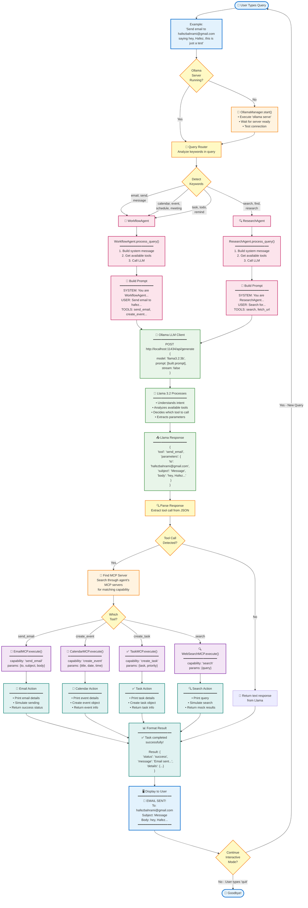

```mermaid
flowchart TD
    Start([👤 User Types Query]) --> QueryExample["Example:<br/>'Send email to hafezbahrami@gmail.com<br/>saying hey, Hafez, this is just a test'"]
    
    QueryExample --> Check{Ollama<br/>Server<br/>Running?}
    
    Check -->|No| StartOllama["🚀 OllamaManager.start()<br/>• Execute 'ollama serve'<br/>• Wait for server ready<br/>• Test connection"]
    Check -->|Yes| Route
    StartOllama --> Route
    
    Route["🔀 Query Router<br/>Analyze keywords in query"] --> DetectKeyword{Detect<br/>Keywords}
    
    DetectKeyword -->|"email, send,<br/>message"| WAgent["🤖 WorkflowAgent"]
    DetectKeyword -->|"calendar, event,<br/>schedule, meeting"| WAgent
    DetectKeyword -->|"task, todo,<br/>remind"| WAgent
    DetectKeyword -->|"search, find,<br/>research"| RAgent["🔍 ResearchAgent"]
    
    WAgent --> WProcess["WorkflowAgent.process_query()<br/>━━━━━━━━━━━━━━━━━<br/>1. Build system message<br/>2. Get available tools<br/>3. Call LLM"]
    RAgent --> RProcess["ResearchAgent.process_query()<br/>━━━━━━━━━━━━━━━━━<br/>1. Build system message<br/>2. Get available tools<br/>3. Call LLM"]
    
    WProcess --> BuildPrompt1["📝 Build Prompt<br/>━━━━━━━━━━━━━━━━━<br/>SYSTEM: You are WorkflowAgent...<br/>USER: Send email to hafez...<br/>TOOLS: send_email, create_event..."]
    RProcess --> BuildPrompt2["📝 Build Prompt<br/>━━━━━━━━━━━━━━━━━<br/>SYSTEM: You are ResearchAgent...<br/>USER: Search for...<br/>TOOLS: search, fetch_url"]
    
    BuildPrompt1 --> LLMCall["🦙 Ollama LLM Client<br/>━━━━━━━━━━━━━━━━━<br/>POST http://localhost:11434/api/generate<br/>{<br/>  model: 'llama3.2:3b',<br/>  prompt: [built prompt],<br/>  stream: false<br/>}"]
    BuildPrompt2 --> LLMCall
    
    LLMCall --> LlamaThink["🧠 Llama 3.2 Processes<br/>━━━━━━━━━━━━━━━━━<br/>• Understands intent<br/>• Analyzes available tools<br/>• Decides which tool to call<br/>• Extracts parameters"]
    
    LlamaThink --> LlamaResponse["📤 Llama Response<br/>━━━━━━━━━━━━━━━━━<br/>{<br/>  'tool': 'send_email',<br/>  'parameters': {<br/>    'to': 'hafezbahrami@gmail.com',<br/>    'subject': 'Message',<br/>    'body': 'hey, Hafez...'<br/>  }<br/>}"]
    
    LlamaResponse --> Parse["🔍 Parse Response<br/>Extract tool call from JSON"]
    
    Parse --> ToolDetect{Tool Call<br/>Detected?}
    
    ToolDetect -->|Yes| FindMCP["🔎 Find MCP Server<br/>Search through agent's MCP servers<br/>for matching capability"]
    ToolDetect -->|No| TextResponse["💬 Return text response<br/>from Llama"]
    
    FindMCP --> ExecuteTool{Which<br/>Tool?}
    
    ExecuteTool -->|send_email| EmailMCP["📧 EmailMCP.execute()<br/>━━━━━━━━━━━━━━━━━<br/>capability: 'send_email'<br/>params: {to, subject, body}"]
    ExecuteTool -->|create_event| CalendarMCP["📅 CalendarMCP.execute()<br/>━━━━━━━━━━━━━━━━━<br/>capability: 'create_event'<br/>params: {title, date, time}"]
    ExecuteTool -->|create_task| TaskMCP["✅ TaskMCP.execute()<br/>━━━━━━━━━━━━━━━━━<br/>capability: 'create_task'<br/>params: {task, priority}"]
    ExecuteTool -->|search| SearchMCP["🔍 WebSearchMCP.execute()<br/>━━━━━━━━━━━━━━━━━<br/>capability: 'search'<br/>params: {query}"]
    
    EmailMCP --> EmailAction["📧 Email Action<br/>━━━━━━━━━━━━━━━━━<br/>• Print email details<br/>• Simulate sending<br/>• Return success status"]
    CalendarMCP --> CalendarAction["📅 Calendar Action<br/>━━━━━━━━━━━━━━━━━<br/>• Print event details<br/>• Create event object<br/>• Return event info"]
    TaskMCP --> TaskAction["✅ Task Action<br/>━━━━━━━━━━━━━━━━━<br/>• Print task details<br/>• Create task object<br/>• Return task info"]
    SearchMCP --> SearchAction["🔍 Search Action<br/>━━━━━━━━━━━━━━━━━<br/>• Print query<br/>• Simulate search<br/>• Return mock results"]
    
    EmailAction --> FormatResult["📊 Format Result<br/>━━━━━━━━━━━━━━━━━<br/>✅ Task completed successfully!<br/><br/>Result: {<br/>  'status': 'success',<br/>  'message': 'Email sent...',<br/>  'details': {...}<br/>}"]
    CalendarAction --> FormatResult
    TaskAction --> FormatResult
    SearchAction --> FormatResult
    TextResponse --> FormatResult
    
    FormatResult --> Display["🖥️ Display to User<br/>━━━━━━━━━━━━━━━━━<br/>📧 EMAIL SENT!<br/>To: hafezbahrami@gmail.com<br/>Subject: Message<br/>Body: hey, Hafez...<br/>━━━━━━━━━━━━━━━━━"]
    
    Display --> Interactive{Continue<br/>Interactive<br/>Mode?}
    
    Interactive -->|Yes - New Query| Start
    Interactive -->|No - User types 'quit'| End([👋 Goodbye!])
    
    %% Styling
    classDef userClass fill:#e3f2fd,stroke:#1976d2,stroke-width:3px
    classDef systemClass fill:#fff3e0,stroke:#f57c00,stroke-width:2px
    classDef ollamaClass fill:#e8f5e9,stroke:#388e3c,stroke-width:2px
    classDef agentClass fill:#fce4ec,stroke:#c2185b,stroke-width:2px
    classDef mcpClass fill:#f3e5f5,stroke:#7b1fa2,stroke-width:2px
    classDef actionClass fill:#e0f2f1,stroke:#00796b,stroke-width:2px
    classDef decisionClass fill:#fff9c4,stroke:#f57f17,stroke-width:2px
    
    class Start,QueryExample,Display,End userClass
    class Check,Route,DetectKeyword,Parse,ToolDetect,ExecuteTool,Interactive decisionClass
    class StartOllama,FindMCP systemClass
    class LLMCall,LlamaThink,LlamaResponse ollamaClass
    class WAgent,RAgent,WProcess,RProcess,BuildPrompt1,BuildPrompt2 agentClass
    class EmailMCP,CalendarMCP,TaskMCP,SearchMCP mcpClass
    class EmailAction,CalendarAction,TaskAction,SearchAction,FormatResult actionClass
```