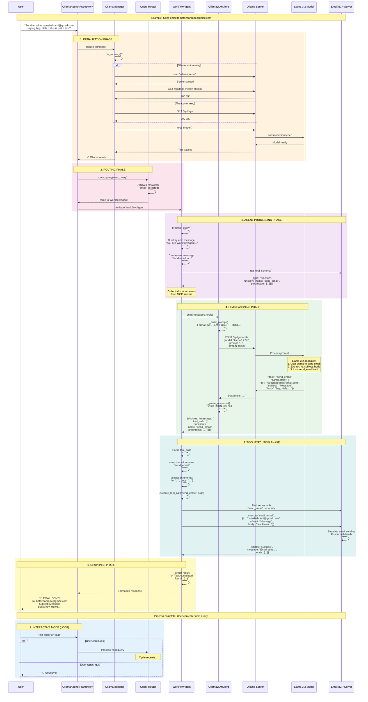

```mermaid
sequenceDiagram
    participant User
    participant Framework as OllamaAgenticFramework
    participant OManager as OllamaManager
    participant Router as Query Router
    participant WAgent as WorkflowAgent
    participant LLMClient as OllamaLLMClient
    participant Ollama as Ollama Server
    participant Llama as Llama 3.2 Model
    participant EmailMCP as EmailMCP Server
    
    Note over User,EmailMCP: Example: Send email to hafezbahrami@gmail.com
    
    User->>Framework: "Send email to hafezbahrami@gmail.com<br/>saying 'hey, Hafez, this is just a test'"
    
    rect rgb(255, 243, 224)
        Note over Framework,OManager: 1. INITIALIZATION PHASE
        Framework->>OManager: ensure_running()
        OManager->>OManager: is_running()?
        
        alt Ollama not running
            OManager->>Ollama: start "ollama serve"
            Ollama-->>OManager: Server started
            OManager->>Ollama: GET /api/tags (health check)
            Ollama-->>OManager: 200 OK
        else Already running
            OManager->>Ollama: GET /api/tags
            Ollama-->>OManager: 200 OK
        end
        
        OManager->>Ollama: test_model()
        Ollama->>Llama: Load model if needed
        Llama-->>Ollama: Model ready
        Ollama-->>OManager: Test passed
        OManager-->>Framework: ✅ Ollama ready
    end
    
    rect rgb(252, 228, 236)
        Note over Framework,Router: 2. ROUTING PHASE
        Framework->>Router: route_query(user_query)
        Router->>Router: Analyze keywords<br/>("email" detected)
        Router-->>Framework: Route to WorkflowAgent
        Framework->>WAgent: Activate WorkflowAgent
    end
    
    rect rgb(243, 229, 245)
        Note over WAgent,EmailMCP: 3. AGENT PROCESSING PHASE
        WAgent->>WAgent: process_query()
        WAgent->>WAgent: Build system message:<br/>"You are WorkflowAgent..."
        WAgent->>WAgent: Create user message:<br/>"Send email to..."
        
        WAgent->>EmailMCP: get_tool_schema()
        EmailMCP-->>WAgent: [{type: "function",<br/>function: {name: "send_email",<br/>parameters: {...}}}]
        
        Note over WAgent: Collect all tool schemas<br/>from MCP servers
    end
    
    rect rgb(232, 245, 233)
        Note over WAgent,Llama: 4. LLM REASONING PHASE
        WAgent->>LLMClient: chat(messages, tools)
        LLMClient->>LLMClient: _build_prompt()<br/>Format: SYSTEM + USER + TOOLS
        
        LLMClient->>Ollama: POST /api/generate<br/>{model: "llama3.2:3b",<br/>prompt: "...",<br/>stream: false}
        
        Ollama->>Llama: Process prompt
        
        Note over Llama: Llama 3.2 analyzes:<br/>1. User wants to send email<br/>2. Extract: to, subject, body<br/>3. Use send_email tool
        
        Llama-->>Ollama: {"tool": "send_email",<br/>"parameters": {<br/>"to": "hafezbahrami@gmail.com",<br/>"subject": "Message",<br/>"body": "hey, Hafez..."}}
        
        Ollama-->>LLMClient: {response: "..."}
        
        LLMClient->>LLMClient: _parse_response()<br/>Extract JSON tool call
        
        LLMClient-->>WAgent: {choices: [{message: {<br/>tool_calls: [{<br/>function: {<br/>name: "send_email",<br/>arguments: {...}}]}}}]}
    end
    
    rect rgb(224, 242, 241)
        Note over WAgent,EmailMCP: 5. TOOL EXECUTION PHASE
        WAgent->>WAgent: Parse tool_calls
        WAgent->>WAgent: extract function name:<br/>"send_email"
        WAgent->>WAgent: extract arguments:<br/>{to: "...", body: "..."}
        
        WAgent->>WAgent: execute_tool_call("send_email", args)
        
        WAgent->>EmailMCP: Find server with<br/>"send_email" capability
        
        WAgent->>EmailMCP: execute("send_email",<br/>{to: "hafezbahrami@gmail.com",<br/>subject: "Message",<br/>body: "hey, Hafez..."})
        
        EmailMCP->>EmailMCP: Simulate email sending<br/>Print email details
        
        EmailMCP-->>WAgent: {status: "success",<br/>message: "Email sent...",<br/>details: {...}}
    end
    
    rect rgb(255, 249, 196)
        Note over WAgent,User: 6. RESPONSE PHASE
        WAgent->>WAgent: Format result:<br/>"✅ Task completed!<br/>Result: {...}"
        
        WAgent-->>Framework: Formatted response
        Framework-->>User: "📧 EMAIL SENT!<br/>To: hafezbahrami@gmail.com<br/>Subject: Message<br/>Body: hey, Hafez..."
    end
    
    Note over User,EmailMCP: Process complete! User can enter next query.
    
    rect rgb(227, 242, 253)
        Note over User,Framework: 7. INTERACTIVE MODE (LOOP)
        User->>Framework: Next query or "quit"
        
        alt User continues
            Framework->>Router: Process next query
            Note over Router: Cycle repeats...
        else User types "quit"
            Framework-->>User: "👋 Goodbye!"
        end
    end
```